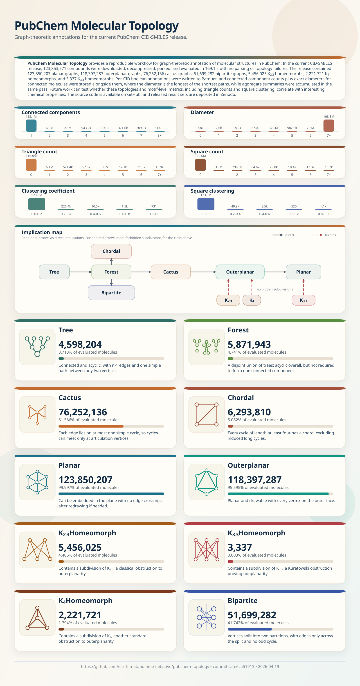

# PubChem Molecular Topology

[](https://github.com/earth-metabolome-initiative/pubchem-topology/actions/workflows/ci.yml)
[](https://codecov.io/gh/earth-metabolome-initiative/pubchem-topology)
[](https://doi.org/10.5281/zenodo.19599330)
[](https://www.rust-lang.org)
[](LICENSE)

Download the current PubChem [`CID-SMILES.gz`](https://ftp.ncbi.nlm.nih.gov/pubchem/Compound/Extras/) release, parse it with [`smiles-parser`](https://github.com/earth-metabolome-initiative/smiles-parser), classify molecular topology with [`geometric-traits`](https://github.com/earth-metabolome-initiative/geometric-traits), write one row per CID to Parquet, write a JSON summary and SVG infographic, and publish the artifacts to Zenodo with [`zenodo-rs`](https://github.com/LucaCappelletti94/zenodo-rs).

Would you like to see more topological properties? Open an issue or submit a pull request!



The Parquet artifact stores one row per PubChem CID with this schema:
`cid`, [`connected_components`](https://en.wikipedia.org/wiki/Connected_component_%28graph_theory%29), [`diameter`](https://en.wikipedia.org/wiki/Diameter_%28graph_theory%29), [`tree`](https://en.wikipedia.org/wiki/Tree_%28graph_theory%29), [`forest`](https://en.wikipedia.org/wiki/Tree_%28graph_theory%29#Forest), [`cactus`](https://en.wikipedia.org/wiki/Cactus_graph),
[`chordal`](https://en.wikipedia.org/wiki/Chordal_graph), [`planar`](https://en.wikipedia.org/wiki/Planar_graph), [`outerplanar`](https://en.wikipedia.org/wiki/Outerplanar_graph), `k23_homeomorph` (contains a [homeomorph](https://en.wikipedia.org/wiki/Homeomorphism_%28graph_theory%29) of [`K2,3`](https://en.wikipedia.org/wiki/Complete_bipartite_graph)), `k33_homeomorph` (contains a [homeomorph](https://en.wikipedia.org/wiki/Homeomorphism_%28graph_theory%29) of [`K3,3`](https://en.wikipedia.org/wiki/Complete_bipartite_graph)),
`k4_homeomorph` (contains a [homeomorph](https://en.wikipedia.org/wiki/Homeomorphism_%28graph_theory%29) of [`K4`](https://en.wikipedia.org/wiki/Complete_graph)), [`bipartite`](https://en.wikipedia.org/wiki/Bipartite_graph).

Example values sampled from the current production dataset:

| cid | connected_components | diameter | tree | forest | cactus | chordal | planar | outerplanar | k23_homeomorph | k33_homeomorph | k4_homeomorph | bipartite |
| --- | --- | --- | --- | --- | --- | --- | --- | --- | --- | --- | --- | --- |
| 1 | 1 | 6 | true | true | true | true | true | true | false | false | false | true |
| 7 | 1 | 6 | false | false | false | false | true | true | false | false | false | false |
| 92 | 1 | 12 | false | false | false | false | true | false | true | false | false | true |
| 299 | 1 | 6 | false | false | false | false | true | false | true | false | true | false |

Aggregate parse and topology failure totals are recorded in the JSON summary, not as per-row Parquet columns.
`diameter` is populated for connected molecules; disconnected molecules are written as `null`.

Reproduce the batch results with:

```bash
cp env.example .env
# optional: set ZENODO_TOKEN in .env to publish to Zenodo
RUSTFLAGS="-C target-cpu=native" cargo run --release
```

Run the browser classifier locally with:

```bash
cargo install dioxus-cli --version 0.7.5 --locked
cd apps/topology-web
dx serve --platform web
```

The app is configured for GitHub Pages deployment at `https://earth-metabolome-initiative.github.io/pubchem-topology/`.
